# User management system

User management system built with Symfony framework.

## Getting Started

```
git clone https://github.com/deividasbagdanskis/user-management-system.git
```

### Prerequisites

[PHP 8.0](https://www.php.net/downloads)

[SQLite 3](https://sqlite.org/download.html)

[Composer](https://getcomposer.org/download/)

[Symfony CLI](https://symfony.com/download)

[Yarn](https://yarnpkg.com/getting-started/install)

### Installing

Install project's dependencies using Composer:

```
composer install
```

Install project's front end dependencies (e.g. Bootstrap, Sass, Webpack) using Yarn:

```
yarn install
```

Build CSS and JS assets:

```
yarn encore dev
```

Create project's database and apply Doctrine migrations:

```

php bin/console doctrine:migrations:migrate

```

Load data fixtures to seed database with initial data:

```

php bin/console doctrine:fixtures:load

```

### Running the project

```

symfony server:start

```

Admin login information:

- username: Admin
- password: password

## Screenshots

### Login page

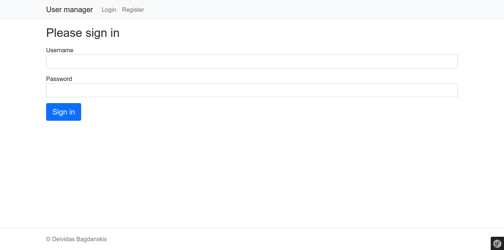<br/>

### Registration page

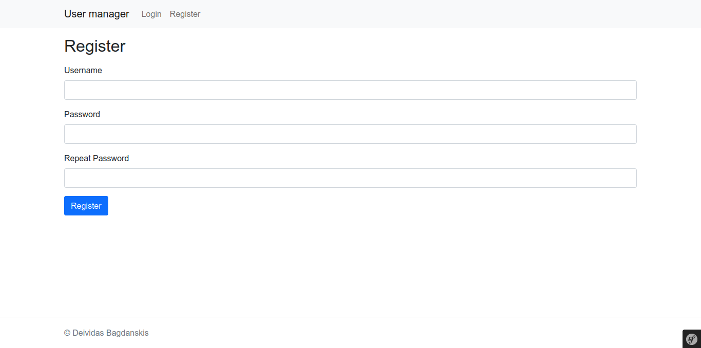<br/>

### User list

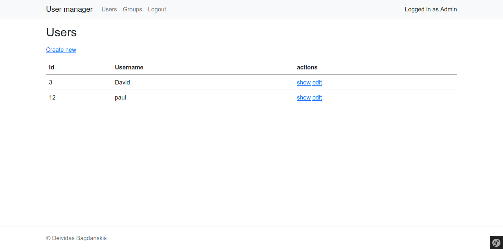<br/>

### Creating a new user

> As an admin I can add users. A user has a name

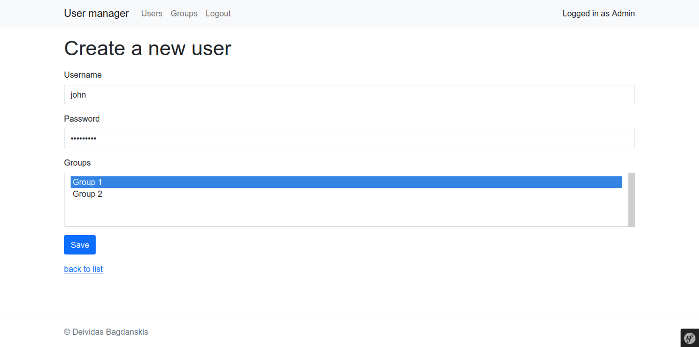<br/>

### User info

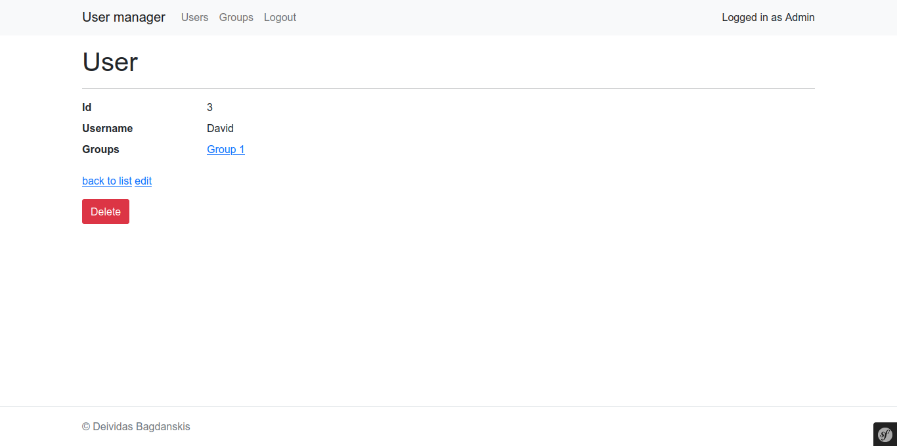<br/>

### Editing user's data

> As an admin I can assign users to a group they aren’t already part of

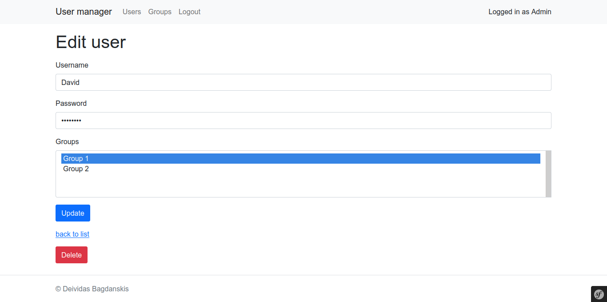<br/>

### Deleting users

> As an admin I can delete users

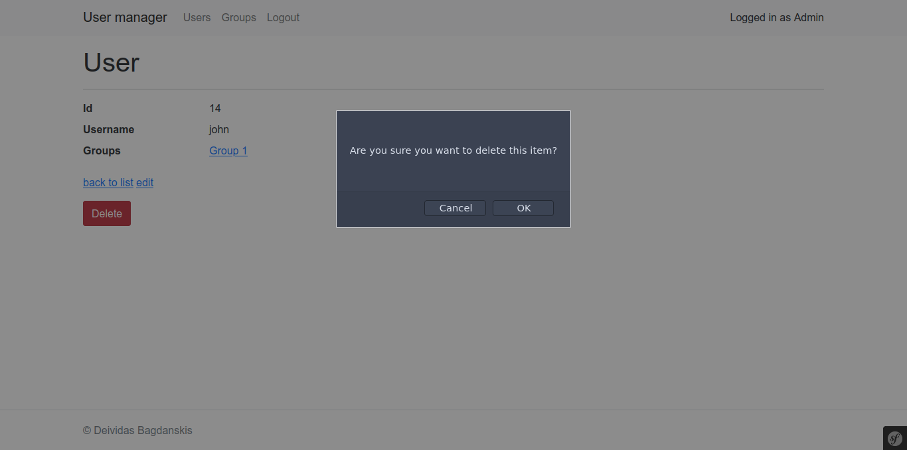<br/>

### Group list

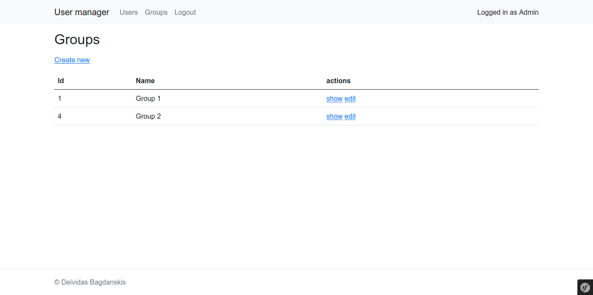<br/>

### Creating a new group

> As an admin I can create groups

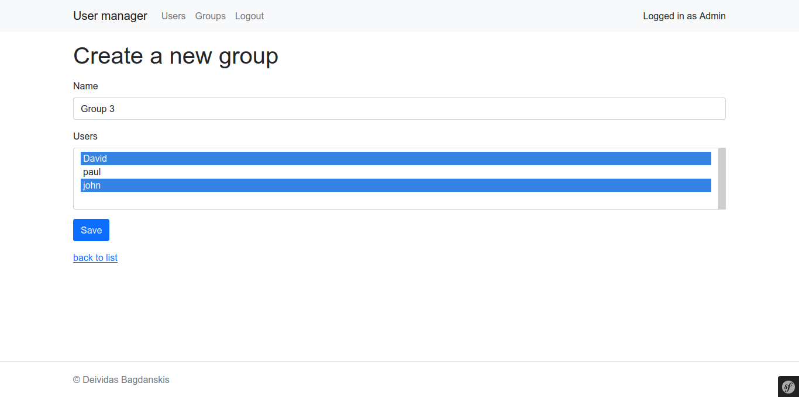<br/>

### Assigning users to a group or removing them from a group

> As an admin I can assign users to a group they aren’t already part of

> As an admin I can remove users from a group

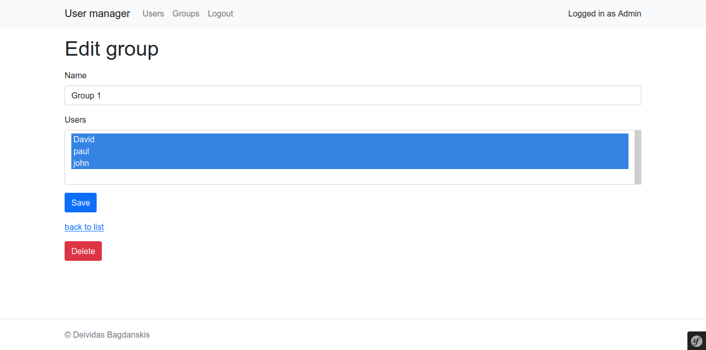<br/>

### Deleting groups

> As an admin I can delete groups when they no longer have members

If a group, that is being deleted, has users assigned to it, an error message is shown.

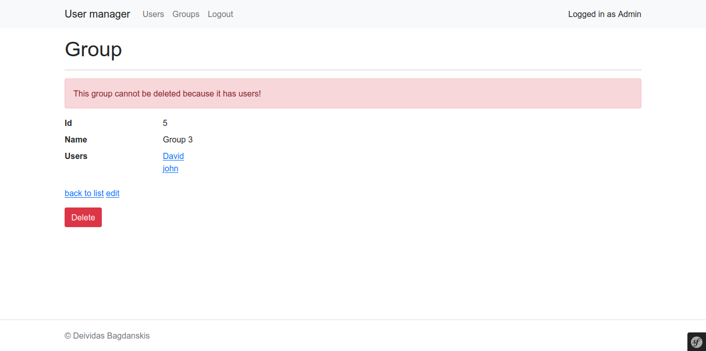<br/>

## License

This project is licensed under the MIT License - see the [LICENSE](LICENSE) file for details.
